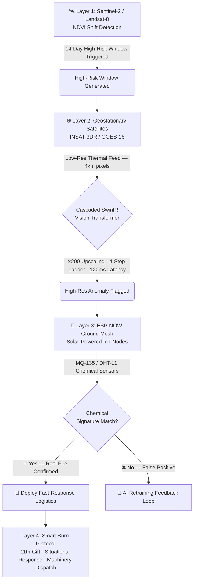

# 🛰️ SATARK PRIME [WORK IN PROGRESS]
### Cascaded AI & IoT Climate Defense Grid
 
<div align="center">
 
[](#)
[](#)
[](https://www.gnu.org/licenses/gpl-3.0)
[](#)
[](#)
[](#)
 
**Stopping the $24 Billion agricultural hydrological hemorrhage in the Indo-Gangetic Plain.**
 
*Built in the mud. Powered by the cloud.*
 
</div>
 
---
 
## 📋 Table of Contents
 
- [The Crisis](#-the-crisis)
- [System Architecture](#️-system-architecture)
- [The Four Layers](#the-four-layers)
- [The Human API](#-the-human-api-sociological-framework)
- [Tech Stack](#-tech-stack)
- [Repository Structure](#-repository-structure)
- [Quickstart & Installation](#-quickstart--installation)
- [Deployment Status & Roadmap](#-deployment-status--roadmap)
- [Institutional Validation](#-institutional-validation)
- [Team & Contributors](#-team--contributors)
- [License](#-license)
 
---
 
## 🌍 The Crisis
 
### Macro & Micro Physics of the Problem
 
The Indo-Gangetic Plain is not an open field — it is a **locked box**.
 
| Trap | Mechanism | Impact |
|---|---|---|
| **The Macro Trap** | The Himalayan barrier prevents winter winds from dispersing smoke, pushing it down into West Bengal | West Bengal becomes "The Sink" for the entire plain |
| **The Micro Trap** | Thermal inversion: cooler ground air capped by a warmer air lid prevents vertical smoke escape | Lethal particulate concentration at ground level |
 
The compounded result is what climate scientists call the **"Indo-Gangetic Gas Chamber"** — stealing **5.3 years of life expectancy** from **500 million people** and generating a **140 Million Tonne annual Carbon Bomb**.
 
---
 
### The Combustion Paradox
 
> *"The smoke chokes the breath out of me... But if we do not burn, we do not plant. And if we do not plant, we do not eat."*
>
> — **Majidan Bibi, Farmer, Kolaghat Block**
 
Farmers are economic captives. The State currently criminalizes survival because it offers no practical alternative:
 
| Option | Cost |
|---|---|
| Manual field clearing labor | ₹600 / day |
| A matchstick | ₹1 |
 
**SATARK replaces blind punishment with a dual engine of predictive logistics and behavioral economics.**
 
---
 
## ⚙️ System Architecture
 
SATARK PRIME operates on a **4-layer verification and interception pipeline**, moving from orbital prediction down to ground-level hardware.
 

 
---
 
## The Four Layers
 
### Layer 1 — Prediction: The GIS Engine
We track the fields **before the match is lit**. Using **Google Earth Engine**, we analyze Sentinel-2 and Landsat-8 imagery to monitor the **NDVI (Normalized Difference Vegetation Index)**. The rapid shift from active-green crop to brown harvested soil generates a precise **14-day High-Risk Window**, enabling pre-positioned logistics.
 
---
 
### Layer 2 — Rapid Response: The SwinIR Upscaler
 
Satellites suffer from a fundamental **spatial-temporal paradox**: geostationary satellites provide 15-minute refresh rates, but their 4km thermal pixels are too coarse to detect a 1-bigha farm fire.
 
SATARK solves "Pixel Scarcity" using a **Cascaded SwinIR Multi-Stage Vision Transformer** via a 3-Step Ladder protocol:
 
| Step | Satellite / Source | Resolution | Role |
|---|---|---|---|
| **Stabilize** | GOES-16 / INSAT-3DR anchored by MODIS | 4km → 1km | Temporal anchor |
| **Sharpen** | Landsat-8 thermal signatures | 100m | Spatial teacher |
| **Guide** | Sentinel-2 optical agricultural boundaries | 20m | Final snap |
 
> **Result:** ~×200 effective upscaling at 120ms latency — bypassing orbital physics entirely.
 
---
 
### Layer 3 — Ground Truth: IoT Chemical Signatures
 
AI hallucinations cost political capital. Every SwinIR alert is cross-validated by an **indigenous, solar-powered ESP-NOW offline mesh network**.
 
- If the AI detects a thermal anomaly **and** field nodes detect a spike in PM2.5 / CO → **Real fire confirmed → Deploy response**
- If the AI detects an anomaly **but** sensors show clean air → **False positive flagged → AI retraining loop triggered**
 
This dual-verification architecture ensures **zero false-alarm dispatches** to field teams.
 
---
 
### Layer 4 — The Smart Burn Protocol: The Compromise
 
When a farmer absolutely cannot afford labor, SATARK shifts from **prevention** to **harm minimization**. The system ingests:
 
- Local wind vectors
- Real-time humidity readings
- Thermal inversion layer presence / depth
 
It then calculates a precise **"Green Window"** — the local time slot where burning will cause minimum particulate stagnation, protecting the densest populated zones downwind.
 
---
 
## 🤝 The Human API: Sociological Framework
 
> *"We don't need new money. We need a Pivot of Personnel. We transform an Enforcement Squad into a Support Squad."*
 
Code cannot hand a farmer a bottle of PUSA Decomposer. SATARK is physically executed by a **decentralized gig-economy of 150+ student Guardians** operating on a **Proof-of-Work ledger**.
 
Three operational frameworks live in the `/sociology_framework` directory:
 
| Framework | Description | License |
|---|---|---|
| **The 11th Gift Protocol** | Operational psychology for approaching economically captive farmers. By providing value first (Soil Health Cards, Subsidy Forms), our SMS alerts are treated as help — not policing. | CC BY-SA 4.0 |
| **Mutual Cooperation Pacts** | Legal framework to secure physical "Green Zones" of unburned land with farmer consent | CC BY-SA 4.0 |
| **Biomass Transfer Manifests** | Ledger system tracking the reallocation and beneficial use of harvested straw | CC BY-SA 4.0 |
 
---
 
## 🧰 Tech Stack
 
| Layer | Component | Technology |
|---|---|---|
| **GIS / Prediction** | NDVI Analysis & Risk Windows | Google Earth Engine, Python |
| **AI Upscaling** | SwinIR Vision Transformer | PyTorch, Transfer Learning |
| **Satellite Sources** | Thermal & Optical Imagery | Sentinel-2, Landsat-8, INSAT-3DR, GOES-16, MODIS |
| **IoT Firmware** | Offline Mesh Network | ESP-NOW, C++, ESP32 |
| **Sensors** | Air Quality & Climate | MQ-135 (CO/PM), DHT-11 (Temp/Humidity) |
| **Hardware** | Node Enclosures | Solar-powered, OSHWA-compliant, Fritzing + 3D Print |
| **Smart Burn Logic** | Meteorological Calculations | Python, Wind Vector Models |
| **Field Operations** | Guardian Dispatch Ledger | Proof-of-Work Ledger System |
 
---
 
## 📂 Repository Structure
 
```
SATARK-PRIME/
│
├── ai_engine/               # PyTorch SwinIR upscaling & transfer learning scripts
│   ├── swinir_cascade.py    # 3-step ladder upscaling pipeline
│   └── retraining_loop.py   # False-positive feedback ingestion
│
├── gis_prediction/          # Google Earth Engine NDVI tracking algorithms
│   ├── ndvi_monitor.js      # GEE script: NDVI shift detection
│   └── risk_window.py       # 14-day high-risk window generator
│
├── firmware/                # C++ scripts for the ESP-NOW mesh network
│   ├── node_main.cpp        # Field node firmware
│   └── mesh_config.h        # Network topology config
│
├── hardware/                # OSHWA Candidate: schematics & enclosures
│   ├── schematics/          # Fritzing .fzz files
│   └── enclosures/          # 3D printable .stl files (solar housing)
│
├── smart_burn_logic/        # Meteorological calculation algorithms
│   └── green_window.py      # Wind + inversion + humidity burn calculator
│
└── sociology_framework/     # CC BY-SA 4.0 PDF Manuals and Field Pacts
    ├── 11th_gift_protocol.pdf
    ├── mutual_cooperation_pact_template.pdf
    └── biomass_transfer_manifest.pdf
```
 
---
 
## 🚀 Quickstart & Installation
 
### Prerequisites
 
| Requirement | Version |
|---|---|
| Python | ≥ 3.9 |
| PyTorch | ≥ 2.0 |
| Google Earth Engine account | Active (free tier sufficient) |
| Arduino IDE / PlatformIO | For ESP32 firmware flashing |
| Node hardware | ESP32 + MQ-135 + DHT-11 + Solar panel |
 
---
 
### 1. Clone the Repository
 
```bash
git clone https://github.com/your-org/SATARK-PRIME.git
cd SATARK-PRIME
```
 
### 2. Set Up the Python Environment
 
```bash
python -m venv venv
source venv/bin/activate        # Windows: venv\Scripts\activate
pip install -r requirements.txt
```
 
### 3. Authenticate Google Earth Engine
 
```bash
earthengine authenticate
```
 
Then update `gis_prediction/config.py` with your GEE project ID and the target region's bounding box.
 
### 4. Run the NDVI Risk Window Generator
 
```bash
python gis_prediction/risk_window.py --region kolaghat --output ./outputs/
```
 
### 5. Flash IoT Node Firmware
 
Open `firmware/node_main.cpp` in PlatformIO or Arduino IDE. Update the following in `mesh_config.h`:
 
```cpp
#define MESH_SSID     "SATARK_MESH"
#define MESH_PASSWORD "your_password"
#define NODE_ID       1             // Unique per node
```
 
Flash to your ESP32 board. Nodes self-organize into the mesh automatically on boot.
 
### 6. Run the AI Upscaling Engine
 
```bash
python ai_engine/swinir_cascade.py \
  --input ./data/thermal_raw/ \
  --output ./outputs/upscaled/ \
  --steps 3
```
 
### 7. Smart Burn Window Calculator
 
```bash
python smart_burn_logic/green_window.py \
  --lat 22.17 --lon 87.92 \
  --date 2026-11-15
```
 
---
 
## 📊 Deployment Status & Roadmap
 
| Phase | Name | Status | Details |
|---|---|---|---|
| **Phase 1** | Trust Audits & Dataset Lock | ✅ Complete | First indigenous fire dataset locked. Ground-truth trust audits finalized. |
| **Phase 2** | 1,000-Bigha Ground Pilot | 🟢 Active — March '26 | Full IoT mesh operational. AI upscaler running on live INSAT-3DR feeds. |
| **Phase 3** | Block-Wide Scale-Out | 🔵 Planned — Q3 '26 | Expanding to full Kolaghat Block (~12,000 bighas). Guardian network expansion to 300+. |
| **Phase 4** | State Replication Template | 🔵 Planned — 2027 | Open-source DPG packaging for replication across IGP states (Punjab, Haryana, UP). |
 
---
 
## 🏛️ Institutional Validation
 
SATARK PRIME is built under the technical and strategic guidance of experts from:
 
- 🇺🇸 **Columbia Climate School**
- 🇺🇸 **Harvard University**
- 🇮🇳 **IIT Bombay / IIT Kharagpur**
 
**Legal Mandates & Field Authorizations:**
 
| Authority | Role |
|---|---|
| Assistant Director of Agriculture, Egra | Technical field authorization |
| Block Development Officer, Kolaghat | Operational deployment mandate |
| Government of West Bengal | State-level DPG mandate |
 
---
 
## 👥 Team & Contributors

| Name | Role | Affiliation |
|---|---|---|
| **Sk Reezaal Arafat** | Project Architect, Lead Researcher & AI/ML Engineer | FTOH Research Collaborative, Purba Medinipur |
| **Soumyadip Paryali** | Field Operations Lead & Sociology Lead | Sahid Matangini Block |
| **Md Sami Alam** | Field Operations Lead | Panskura |
| **Sagar Das** | Field Guardian Manager | Siddha |
| **Vidyanand Rathod** | Operations Advisor | Mumbai |
| Soumyadeep Adhikari | Field Guardian | Kolaghat Block |
| Sanket Kuila | Field Guardian | Kolaghat Block |
| Arka Hazra | Field Guardian | Kolaghat Block |
| Rehan Mallick | Field Guardian | Kolaghat Block |
| **150+ Student Guardians** | Ground Mesh Operations | Purba Medinipur, WB |

> 💡 *Want to contribute? See [CONTRIBUTING.md](./CONTRIBUTING.md) or reach out via Issues.*

---
 
## 📜 License
 
| Component | License |
|---|---|
| Software (AI, GIS, Firmware) | [GNU GPL v3](https://www.gnu.org/licenses/gpl-3.0) |
| Hardware Schematics & Designs | [CERN Open Hardware Licence S v2](https://ohwr.org/cern_ohl_s_v2.txt) |
| Sociology Framework Documents | [Creative Commons BY-SA 4.0](https://creativecommons.org/licenses/by-sa/4.0/) |
 
---
 
<div align="center">
 
**SATARK PRIME** is a candidate Digital Public Good (DPGA) and Open Source Hardware (OSHWA) project.
 
*For partnerships, replication mandates, or field deployment support — open an Issue or Discussion.*
 
**Built in the mud. Powered by the cloud. 🌾🛰️**
 
</div>
